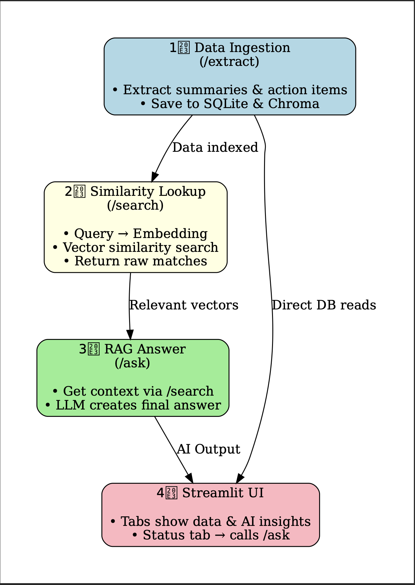

# Aurora – AI Leadership Copilot  

## 📌 Overview
Aurora is an AI-powered leadership copilot that helps Engineering Managers save time and communicate effectively.  
In Week 1, we build the **core extraction pipeline**: taking raw meeting text (transcripts or notes) and converting it into structured outputs:  
- ✅ **Decisions**  
- ✅ **Action Items**  
- ✅ **Blockers**  

This will form the foundation for later features like weekly reports, dashboards, and automated follow-ups.  

---
### Project Structure 
- src/core/ – Handles LLM calls, prompt templates, text/audio processing.
- src/data_pipeline/ – Connects APIs, manages DB, embeddings.
- src/features/ – Implements your main EM-focused functionality.
- src/dashboard/ – Streamlit UI modularized per feature.
- data/ – Keep all raw or temporary data separate from code.
- tests/ – Write simple unit tests.
- docs/ – Architecture diagrams.

---

## ⚙️ Setup Instructions
```bash
### 1. Clone Repository
git clone https://github.com/<your-username>/aurora-leadership-copilot.git
cd aurora-leadership-copilot

### 2. Create Virtual Environment
python -m venv .venv
source .venv/bin/activate   # Mac/Linux
.venv\Scripts\activate      # Windows

### 3. Install Dependencies
pip install -r requirements.txt

### 4. Ensure Ollama is Running
Install Ollama: https://ollama.ai

Start Ollama in background.

Test a model:
ollama run llama3.1 "Hello"

### Run Tests
python -m pytest
OR
python3 -m pytest --capture=no # to display print on terminal from test cases
python3 -m pytest --capture=no --disable-warnings # to disable warnings

### Run the application
    #Activate your virtual environment (if not already):
        source .venv/bin/activate
    #Install requirements:
        pip install -r requirements.txt
    #Run your FastAPI app from your project root:
        uvicorn main:app --reload --app-dir src

--- 
```   
## API's
    /vector/search
        Purpose: Pure retrieval from the vector DB.
        What it does:

        Finds the most semantically similar items (clips, journals, meetings).

        Returns them as-is with metadata.

        When to use:

        You (or UI) just want to browse or preview raw matches.

        Example: “Show me all notes about API” → returns meeting summaries & clips mentioning API.

        Benefit:

        Transparent, fast, no LLM hallucinations.

        Great for debugging RAG or building dashboards (like smart clipboard history).
    /rag/ask
        Purpose: RAG-style reasoning and synthesis.

        What it does:

        Uses /search internally to get relevant chunks.

        Feeds them into an LLM prompt.

        Returns a natural language answer.

        When to use:

        You want a direct, summarized answer instead of raw docs.

        Example: “What decisions were made about the API?” → AI answers using context. 


## Conceptual flow

        1️⃣ Data Ingestion (/extract)

        Endpoints: /meeting/extract, /clip/extract, /journal/extract

        Purpose: Feed raw text (meeting transcripts, chat clips, journal entries) into the system.

        What happens:

        LLM extracts summary, action items, decisions, blockers.

        Saves structured data in SQLite tables.

        Adds the text to Chroma vector DB for later retrieval.

        This is the foundation — every text source you want searchable or usable in RAG goes through here.

        2️⃣ Similarity Lookup (/search)

        Purpose: Find content similar to a user query.

        What happens:

        Query converted to embedding.

        Compare against Chroma vectors.

        Return matching raw items with metadata (meeting, journal, clip).

        Use case:

        “Show me all clips about API issues.”

        Useful for raw reference without LLM summarization.

        3️⃣ RAG Answer (/ask)

        Purpose: Generate an AI answer using multiple sources.

        What happens:

        Internally calls /search to get relevant vectors.

        Sends them to Ollama LLM with a prompt like:
        “Based on these documents, summarize the action items for API issues.”

        LLM produces coherent, human-readable answer.

        Use case:

        “What should I do this week based on my meetings and journals?”

        This drives the smart summaries, weekly status report, and meeting trackers.

        4️⃣ Streamlit UI Integration

        Sidebar Tabs:

        Clipboard → shows /search results for clips.

        Meetings → shows meetings + action items (from DB).

        Journal → shows journals + decisions/action items.

        Status Report → calls /ask to generate weekly summaries.

        Key Idea:

        /extract → ingest & save.

        /search → quick reference / history.

        /ask → AI-generated insights & summaries.

[📄 View the Flow in PFD ](./docs/system_flow_diagram.pdf)


### UI Flow

Sidebar

    Title: AI Productivity Hub 
    
    HomePage : Dashboard 

    Navigation options:

    📋 Clipboard History (Clips)

    📅 Meetings

    📔 Journals

    📊 Weekly Status Reports

    🔍 Search

    🤖 Ask Assistant


